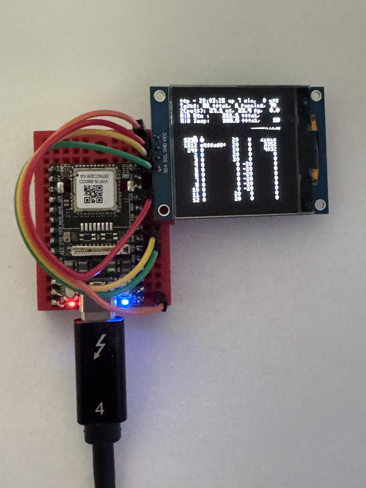

# nixos-nanokvm

NixOS image and packages for the Sipeed NanoKVM (SG2002 / cv1800,
RISC-V C906). One flake builds:

- production SD images for the **nanokvm-pcie** board (vendor kernel),
- USB-boot bring-up paths for the **licheerv-nano-w** dev kit (both
  mainline and vendor kernels),
- a kexec-based stage 2 → stage 2 dev loop served over USB-ECM NBD.

The catalog of every shipped configuration lives in `lib/catalog.nix`;
all `nixosConfigurations.boards.*` and `packages.<sys>.boards.*` outputs
are generated from that one list.



## Build

```sh
nix build .#nanokvm-server                # the NanoKVM Go+Web userspace
nix build .#boards.pcie.vendor.sd         # production SD image
```

The Go server is cross-compiled with `riscv64-musl-gcc` using GCC's
modern C906 spelling (`-mcpu=thead-c906 …`). The vendor toolchain is
also packaged as `.#sophgo-host-tools` for parity testing.

We extract the OpenCV video runtime + Sophgo multimedia kernel modules
from the official v1.4.2 NanoKVM image; those binary artifacts are
unfree-redistributable, marked accordingly.

## Dev loop on the LicheeRV-Nano-W

Bring up the board in BOOT mode (hold the BOOT button while connecting
USB-C). Then:

```sh
# Smoke-test mainline kernel in initrd-only mode (10 s boot, no rootfs):
nix run .#boards.licheerv.mainline.kernel-test.usb-boot

# Full stage-2 over NBD with the standard CDC-ECM gadget:
nix run .#boards.licheerv.mainline.live.usb.usb-boot
# → SSH on root@10.55.0.1 or nixos@10.55.0.1 (password: nixos;
#   host key cached at $PWD/.ssh_host_*_key, per-device, gitignored).
# Leave the process running — it's the NBD backing store for /nix/.ro-store.

# Full stage-2 with the 128x128 OLED framebuffer running top on-screen:
nix run .#usb-oled-top

# Record that boot/kexec flow and render an animated GIF:
nix run .#capture-usb-oled-top
```

`usb-oled-top` uses ROM/fastboot when the board is in BOOT mode. If a
previous live image is already up on the USB debug network, the same
command detects the USB-ECM host interface and kexecs directly into the
new image instead. Override with `NANOKVM_BOOT_MODE=usb` or
`NANOKVM_BOOT_MODE=kexec` when you want to force one path.

The host-side runner configures the USB-ECM iface as `10.55.0.2/24`,
serves the EROFS rootfs via `nbd-server`, passes the chosen NBD endpoint
on the kernel cmdline, and pushes pre-generated SSH host keys via the
initrd debug shell so the SG2002 doesn't spend ~60 s on `sshd-keygen`.
SSH is up ~10 s after `bootm`. Set `NANOKVM_NBD_ROOTFS_PORT=<port>` to
force a port; the default `auto` chooses a free runtime port.
Direct USB boot also cleans up stale NanoKVM rootfs `nbd-server`
processes; set `NANOKVM_NBD_CLEANUP=0` to opt out. By default the
runner then attaches to the target shell on TCP/2323.
After stage 2 is up this enters the normal `nixos` user account through
the system login shell; if the boot stalls before pivoting, the same
port is still the initrd BusyBox shell. Use `NANOKVM_ATTACH=none` to
keep only the NBD backing store open, or `NANOKVM_STATUS_LISTEN=1` to
print the verbose target status stream. For `usb-oled-top`, shell
logout defaults to `NANOKVM_ON_DETACH=kexec`, which immediately kexecs
the target once into the currently built image; set
`NANOKVM_ON_DETACH=hold` to preserve the old rootfs NBD session instead.

`capture-usb-oled-top` writes an asciicast plus rendered GIF under
`media/captures/`. It sets `NANOKVM_ATTACH=none` by default so the
recording ends after the runner reaches SSH or hands off the new rootfs
NBD socket. The runner is left alive after capture so the target keeps
its rootfs; stop the printed PID when you are done, or set
`NANOKVM_CAPTURE_KEEP_RUNNER=0` to make capture teardown automatic.

If `lib.protocol`'s default MAC doesn't match (e.g. you've renamed the
gadget), pass the iface name explicitly:

```sh
USB_IFACE=usb0 nix run .#boards.licheerv.mainline.live.usb.usb-boot
```

### Transport variants

```sh
nix run .#boards.licheerv.mainline.live.usb.usb-boot         # CDC-ECM
nix run .#boards.licheerv.mainline.live.usb-rndis.usb-boot   # RNDIS
nix run .#boards.licheerv.mainline.live.usb-ncm.usb-boot     # CDC-NCM
nix run .#boards.licheerv.mainline.live.usb-g-multi.usb-boot # g_multi (RNDIS+ACM+ms)
nix run .#boards.licheerv.mainline.live.usb-oled.usb-boot    # ECM + OLED panel
nix run .#boards.licheerv.mainline.live.wifi.usb-boot        # USB-ECM control,
                                                             # rootfs over wifi
```

### Stage 2 → stage 2 kexec

Once a stage 2 is up on ECM, switch to a different variant without a
USB-reboot:

```sh
nix run .#boards.licheerv.mainline.live.usb-rndis.kexec
```

The kexec runner serves the new payload over a second NBD socket
(10810), tells the target's `usb-kexec-control@.service` (port 2325)
to load+exec it, then swaps the rootfs nbd-server for the new variant's
EROFS.

### kernel-test / debug variants

`kernel-test` boots an inert-stage-2 initrd to validate kernel+initrd
without committing to a rootfs. `debug` boots an inert initrd that has
the kexec control plane but no auto-pivot — useful when you want to
inspect early-stage state by hand.

```sh
nix run .#boards.licheerv.mainline.kernel-test.usb-boot
nix run .#boards.licheerv.mainline.debug.usb-boot
```

## Patch workflow

For local-only fixes to the upstream NanoKVM tree:

```sh
git -C ../NanoKVM diff > patches/nanokvm/0001-my-change.patch
nix build .#nanokvm-server
```

Patches must apply at the NanoKVM repo root so they cover both `server/`
and `web/`.

For kernel patches against `linux_latest`, see `pkgs/sg2002/linux-mainline/`.
Each patch should carry origin + upstream-status metadata.

## Using `nanokvm-server` on a non-cv181x host (Rock-5B etc.)

The Go server + web UI is portable. Hardware integrations (HDMI
capture via the Sophgo camera SDK, USB-C HID gadget) are cv181x-only,
but the rest of the server runs fine on any aarch64 / x86_64 NixOS
host as a web-UI-only stub. Useful for development and as a remote
"NanoKVM looking glass" that aggregates over other KVMs.

In your downstream flake:

```nix
inputs.nanokvm.url = "github:grw/nixos-nanokvm";  # or path:/home/grw/src/nixos-nanokvm

outputs = { nixpkgs, nanokvm, ... }: {
  nixosConfigurations.rock5b = nixpkgs.lib.nixosSystem {
    system = "aarch64-linux";
    modules = [
      nanokvm.nixosModules.default   # imports module + applies overlay
      ({ ... }: {
        services.nanokvm = {
          enable = true;
          # cv181x-only services — leave off on Rock-5B / x86_64:
          kmods.enable = false;     # Sophgo multimedia kmods
          usbGadget.enable = false; # cv181x USB-C composite gadget
          hdmi.enable = false;      # HDMI capture pipeline
          # Pick non-privileged ports if you don't want CAP_NET_BIND:
          httpPort = 8080;
          httpsPort = 8443;
          openFirewall = true;
          hardwareVersion = "pcie"; # value written to /etc/kvm/hw
        };
      })
    ];
  };
};
```

When `kmods.enable = false` and `usbGadget.enable = false`, the
module skips all cv181x-specific vendor compat (init.d scripts,
kernel module loading, configfs gadget). The activation script is
idempotent about files that aren't present in the native (non-riscv64)
nanokvm-server build, so it stays clean.

What you get on aarch64:
- Web UI on `httpPort`
- Login / authentication flow
- All the dashboards/widgets the upstream server exposes

What you don't get without cv181x hardware:
- HDMI capture (no camera SDK on aarch64)
- USB HID forwarding (no peripheral USB controller / picoclaw)
- Power-control GPIOs

## Local files (optional)

- `./authorized_keys` — root SSH pubkeys baked into the image. Empty by
  default. The usb-boot runner additionally pushes ephemeral keys via
  the initrd debug shell, so this is only needed for non-USB
  deployments.
- `./wifi.conf` — `wpa_supplicant.conf` body. Used only when the wifi
  mixin is in the configuration. **Contents end up in the nix store.**
- `./.ssh_host_{ed25519,rsa}_key{,.pub}` — auto-generated host keys
  (gitignored). The usb-boot runner generates these on first run and
  pushes them to the device so `sshd-keygen` skips.

## What's where

| Path | What |
| --- | --- |
| `flake.nix` | flake glue. Generated; do not duplicate matrix here. |
| `lib/catalog.nix` | single source of truth for shipped configs |
| `lib/artifacts.nix` | host-side artifact + runner builders |
| `lib/runners.nix`* | (planned, currently inside artifacts.nix) |
| `lib/host-prelude.nix` | bash glue shared by every runner |
| `lib/protocol.nix` | USB-ECM MACs, IPs, ports |
| `lib/mkBoard.nix` | nixosSystem composer |
| `boards/` | per-board NixOS modules |
| `platform/` | shared cv181x platform module |
| `profiles/` | per-profile NixOS modules (kernel-test, debug, live, sd) |
| `modules/` | service modules (usb-control, nbd-live, gadget, oled, …) |
| `modules/control-plane/` | per-facet control-plane modules |
| `pkgs/` | overlay derivations (kernels, U-Boot, FIP, vendor blobs, …) |
| `scripts/` | host-side dev scripts (bench, etc.) |
